# Can you prove it?

### An introduction to plural science for interested systems

<!-- 

Do you know this?

Someone makes an incredibly weird claim about all systems and treats it as absolute truth? Or some medical professional "does not believe in DID" and refuses treatment according to it?

Wouldn't it be nice to be able to search and reference actual, scientific evidence for it? You&'ve come to the right talk. In the next 35 slides, I want to empower you to "do your own research" and give you some tools to evaluate if a study is good or badly done. Of course, this is an gigantic topic and if I'd try to cover it all, I'd make a course out of it and hand out credits, but I hope after we are done, you feel ready to start your own journey into plural science. Lets go.

-->

---

### Content Warning

<ul>
    <li><b>Bad science</b>
    <ul>
      <li>Medicalism</li>
      <li>Fake Claiming</li>
      <li>Abuse</li>
    </ul>
</ul>

<!--

So, if we do science, we sadly can't get around triggers.
A lot of plural research cluster around the spectrum with "It doesn't exist on one end" and "How can we make it stop existing" on the other. On top, there is also some general abuse in the field.

Its not fun, but I hope you are prepared to get through it. I can promise I will keep the triggers as abstract and as minimal as I can. 

-->

---

### About us

<ul>
<li>Traumagenic system of many</li>
<li>No professional scientist</li>
<li><b>Self-Plug</b></li>
  <ul>
  <li>Podcast</li>
  <li>Little research project</li>
  <li><Github href="github.com/plural-activism/presentation_introduction-to-plural-science">Github</a></li>
</ul>

##### github.com/plural-activism/presentation_introduction-to-plural-science

#### papers.plural.ziegel.me

<!--
We are a traumagenic system of many, at the moment the headcount is between 40 and 50. We have studied economics and computer science, but never got to properly publish anything. So you can very much assume as amateurs.

For the obligatory self-plug
- We run the "How About You Podcast", if you want to talk about more casual plural experience, find the link in the description ;)
- Then I have to point out the reason this talk started, one of my headmates started to work on a research project / survey about system littles, if that sounds interesting to ya, hit me.
- And as always, this talk is published on Github, together with some bonus content, you can find also other talks i did in the past there.
-->

---

## Step 0: Preparations

<!--

So, before we start our science journey, I want to give you& a handful of homework you might prepare before we jump into the depths of plural research. Don't worry, nobody is gonna test you on it.

-->

---

# 50% of the time, statistics is important all of the time

<!--

As Homer correctly identifies, knowing your statistics if incredibly useful. Even if you read works that use qualitative data, knowing statistics teaches you what qualitative means.

In general, you should know what a hypothesis is, and how a bad hypothesis looks like. What variables in statistics mean, and how researchers isolate them properly. Of course you should also know your distributions, and when your population is big enough to form one. A bit knowledge about statistical tests is useful too, ideally you can tell what a t test is.

While I'd love to teach you& all statistics, we don't have time to go into any details. If you& are completely unfamiliar with the matter, there are many great courses on the internet, some of which I have linked on Github.

-->

---

### Theory of Science

- **Find**
- **Read**
- **Contextualize**

<!-- 
- How to find good sources?
- How to read sources?
- How to contextualize sources? 
-->

---

### Psychology

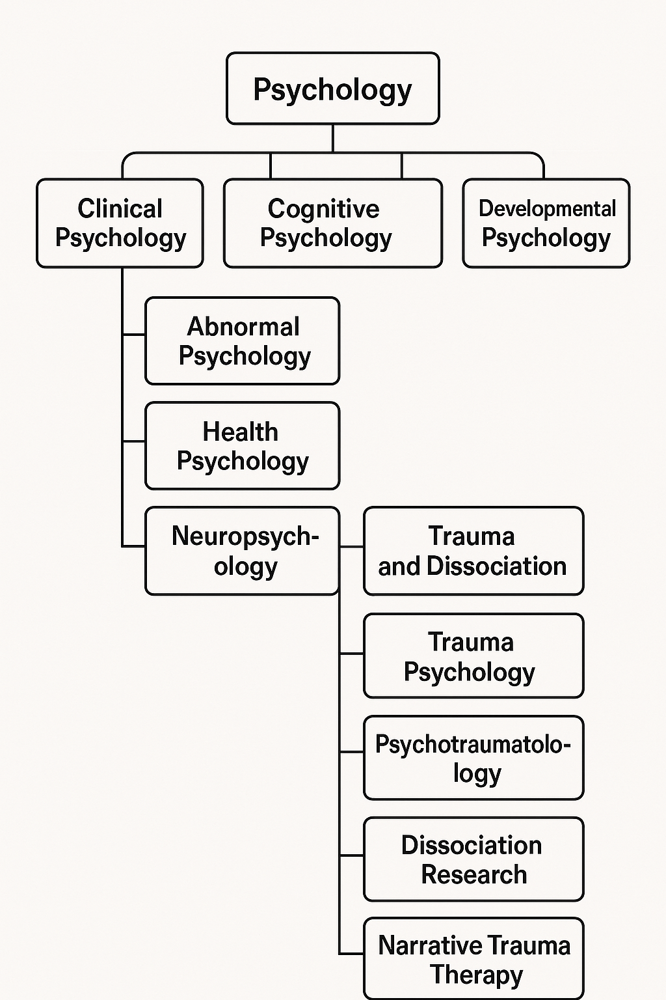

> Overrated af, ngl

*zeta, 2025*

<!--

Now comes the hottest take of the conference, and there will be a few:

You actually don't really need to know psychology if you want to research plural science.

Sure its useful to have a very broad idea of different models used in psychology, but the truth is that plurality is so far detached from these standard models, that you might as well ignore them. If works of research do reference models nonetheless, the usually explain them anyways.

I'd always recommend to spend time learning statistics instead of psychology.

If you& do want to learn more about psychology, I recommend looking into clinical psychology, and Trauma and Dissociation inside of clinical psychology specifically.

-->

---

## Selfcare

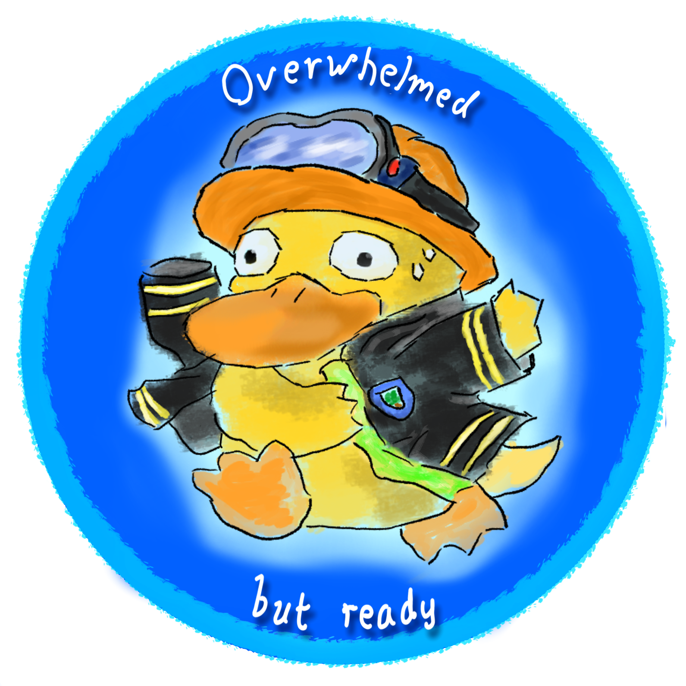

<!--

The fourth skill you should have is to take care of yourself and your system.

- Science is dehumanizing
- Science can be overwhelming

It's important to reckognize when to take a break, and actually taking it. Be prepared to read some unhappy things and have the skills ready to calm yourself reading it. You& are more important than any paper ever could be.

-->
---

## Step 1: Reading research

<!--

So, everything ready? Them lets start to discuss how to actually approach science. In this step, i will give you an super broad overview of how scientific works ... work, and tips and tricks how to deal with them. When we are done, you hopefully feel ready to read your first scientific literature.

-->

---

### What to read?

<!--

There are usually two main types of scientific literatures

- Textbooks
- Research paper

Since there are only a handful of plural textbooks that are not selfhelp focused, outdated or written by problematic people. we will for now focus on research papers.

Papers are published in journals. Papers can contain all kinds of works, starting from a mere opinion piece, over a case study, an fully study with multiple participants, to meta studies that summarizes multiple papers in one. The structure always follow the same general structure and we will have a look at it later on.

-->

---

### Where to find papers?

<!--

Now that we know what to read, where do we find our papers?

There are many more resources than the three here, but

For beginners, I would recommend the following:

- Google Scholar is the defacto search engine to find papers about virtually every topic. Not every paper there is publicly available, but for that work arounds exist.

- Arxiv (I always call it ArchiveX and will keep doing it) is a huge Hoster of pre-published papers. That means they are in fact not peer reviewed, and the version you find there might not the final version that got published. Still its a great resource to find the newest research.

- Then, if you have trouble because a paper is behind a paywall - try asking friends who work in academia and have access to libraries, or just politely contact the researcher directly and ask if they could share a copy. 

-->
---

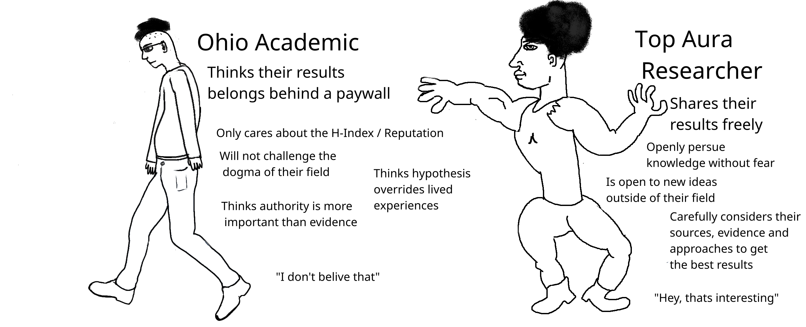

<!--

I know asking for a paper might be a scary thing to do, but it often works. Basically everyone in science loves if their stuff got read, so unless they are an ohio academic, they probably will gladly share what they know.

-->

---

### The anatomy of a paper

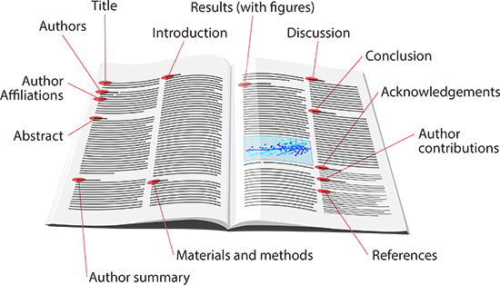

<!--

On the right you see the different elements you commonly find in a paper, not every paper has all of these elements, and sometimes they are named a bit differently, but overall you can expect to find all these things.

Now, I wanna you to focus on these four things only in the beginning. You sure can read the rest of the paper, but your effort should be put into Keywords, Abstract, Methodology and Results.

I deviate here a bit from the advice you can commonly find, and with good reason. We don't want to read paper as quickly as possible. If you are following this far, take your time. What we want to do is to deeply understand how plural science is done, and build up an intuition of when a paper is doing some good research and when it is to be disregarded.

And there will be quite a few papers in your research journey that you can ignore.

-->

- Keywords
<!-- Only a handful allowed -> good  overview of why the paper is important -->
- Abstract
<!-- Like the back text of textbook, tries to sell the paper, highlights what the research question is, why it is important, how they did research and summarizes the results -->
- Methodology
<!-- Important to understand the qualities of a paper -->
- Results
<!-- What did they find? -->

---

<!-- Keywords -->

<!-- 

The good point of Keywords is, that your journal usually only allow you to have a handful of them.

They are used to find the paper, but also to archive it, meaning, whoever writes the paper, they have to carefully chose which words represent the content of the paper the best.

We can exploit this fact. If ya want the quickest glance possible of what to expect in a paper, check the keywords.

As a bonus, it also teaches you the vocabulary researchers use.
-->

<!--
Paper / Image source:
-->

---

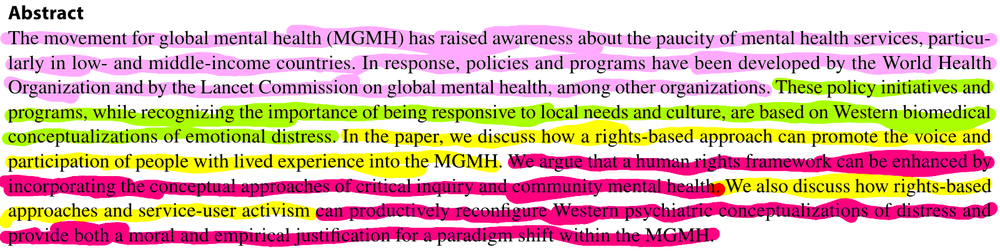

<!-- 
Usually, an abstract contains 4 parts, as you can see here:

The light pink part contextualize the ideas the paper uses, it drops the important keywords for people in the field to know what they base their work on.

In the greent part, the sell us why their work is important.

The yellow sentence shows what they do in the paper, what their methodology is.

Then the highlight the most important result, in the case of this paper, the last sentence is a mix of results and methods.
-->

<!--
Paper / Image source:
-->

---

<!-- Methodology -->

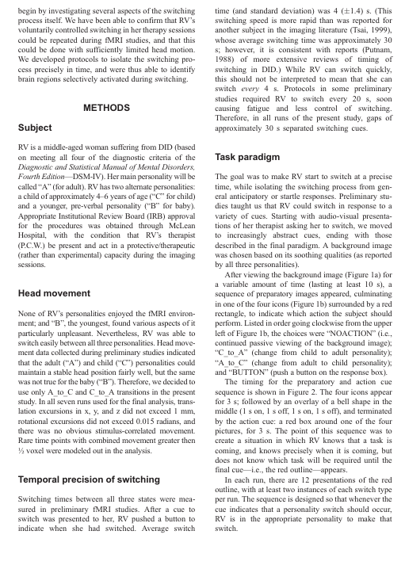

<!-- 

Reading Methodology can be tough. And its the section in which statistics can become real handy. Your goals in this section should be:

-

A good was to achieve this is:

-

-->

<!--
Paper / Image source:
-->

---

<!-- Results -->

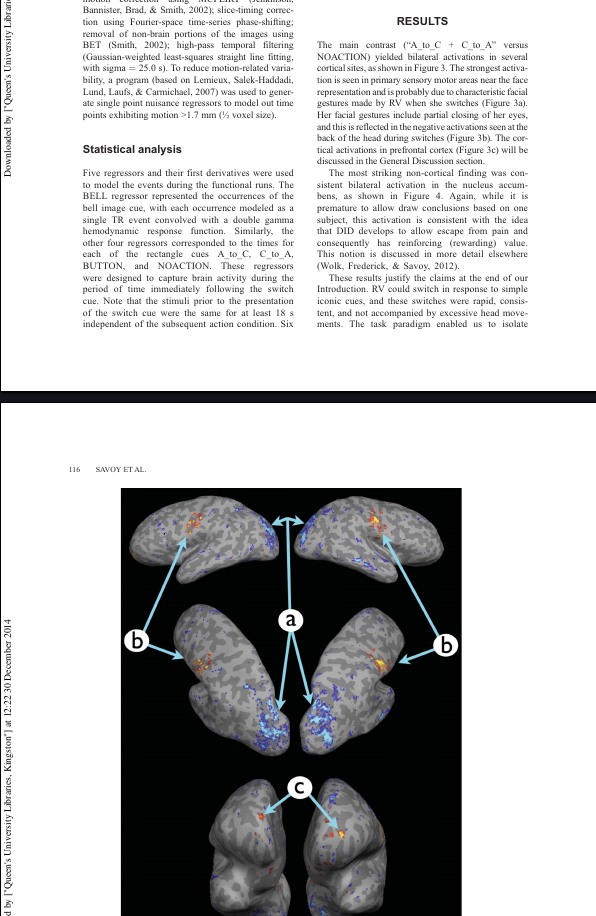

<!-- 

While a lot of people recommend to read the conclusion rather than the results, I think its better for beginners to focus on the latter. The difference is that the results are the raw, uninterpreted data, while the conclusion is the ... well conclusions that can be extracted out of it.

When reading the results, think for yourself
- What would I conclude of this?
- Are there results I didn't expected and why?
- Are there results I'd expect, but that are missing?
- What seems to be the most important result in there, what is the least important?
- How does these results connect with things I already know?

If you keep notes with these questions in mind, you will pretty quickly build an network of ideas and conecpt you can cross reference, and by proxy understand what the field knows - and what it doesn't.

-->

<!--
Paper / Image source:
-->

---

#### Quality Markers: Is it easy to read?

<!-- 

At first this sounds counterintuitive. Science is supposed to be rigorous, solving hard to grasp problems. The thing is though, scientific writing is a skill that can be practiced. The difference between a beginner scientist and a veteran is often how easy they can convey their ideas. And thats the second point why easy to read papers are important. A paper is the culmination of all the ideas, data and conclusions a scientist have, presented in a way so its accessible to the world. If the world cannot understand it, someone failed their assignment.

So when reading a paper, check if 
- it uses overly complicated sentence structures or unusual grammar and vocabulary?
- Does it explain all concepts it introduces and justify why they are important? You might have too look them up still, but if you don't even know where to start, its a badly written paper?
- Notice the small things - are all abbreviations spelled out at least once? Are there spelling mistakes? Bad formatting? 

A paper might contain super complex ideas, but it should make it as easy as possible to understand them. If it doesn't that usually means someone inexperienced wrote it, or someone who didn't want to put in the effort.
-->

---

#### Quality Markers: Is it Peer Review?

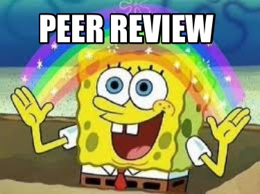

- **Always** insist on peer review
- Not perfect, but insures quality baselevel
- Only Exception: **Arxiv**¹

<!--

Peer review is the most basic quality measure of modern science. It means that a couple of other researcher will check a paper before it gets published and evaluate if it meets the quality requirements of the paper.

These peer reviewers are almost always unpaid volunteers, and might not always be experts and the specific topic of the paper.

So while its the basic quality measure, it should not be your only one.

-->

<!--
1: Source
-->

---

#### Quality Markers: What is the Methodology?

- Type of data
- Type of analysis
- "Does it make sense?"

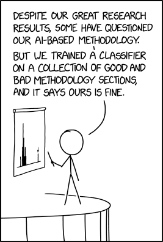

<!--
- Sample size
- Sample selection
- Sample diversity
- Sample representativity
-->

---

#### Quality Markers: H-index

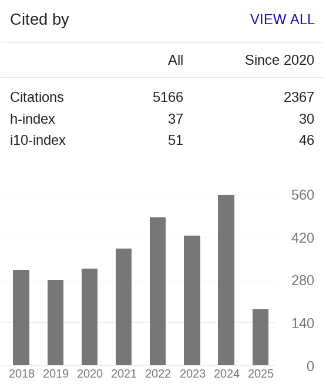

> The h-index is an author-level metric that attempts to measure both the productivity and citation impact of the publications of a scientist or scholar.¹

<!-- 

Both H-Index of citation does not indicate the quality of a paper by itself - but it can tell us if the author and their paper has made an impact. Even if its impact because they did some reaaally bad job and now everyone loves cite them as an example of bad work.

As you might have noticed, the H-index is a metric of the author, so what can you do if there is more than one author? You could of course check all authors, but honestly checking the first one is enough. That is usually the one who contributed the most to the paper (good practice) or the one with the most reputation (bad practice).

This is the H-Index of A A T S Reinders and finding hers is a pain since she seems to love using a different of her four names - or sometimes none - in every paper she has worked on.

-->

<!--
1: Source: 
-->
---

#### Quality Markers: Proper sourcing

- Every claim is sourced
- Every referency is cited at least once
- Every source should be recent or a classic
- The sources are relevant to the topic
- The sources actually say what the author claims

<!--

You might have noticed the small numbers at the end of sentences. These are citations, and you can check them out in the slides files.

A scientific work lives or dies with its sources. As a rule of thump, every claim that is not common knowledge (e.g. the sky is blue) needs to have a source. With its sources, an author can highlight their knowledge in the field, and they can show how their work compares to that of others. So by the sources the author use, you can quickly deduce what they have read, what they think is important and how recent their knowledge is.

-->
---

## Congratulations

<!--

And with that, you have already done 80% of the work of a researcher reading papers! Sure there are more things to consider, and you can always improve your skills, but if you have followed through so far, you are on a really good track already.

-->

---

#### Things to ignore

- The journal
- The author

<!--

There is only a handful of journals that specialize in plural research. And they all have "Dissociation" in the title. But to be honest, most interesting papers are published in much broader journals, so I personally wouldn't care too much about the specific one, as long as it is peer-reviewed.

A lot of people suggest to do some research on the authors who wrote the paper, if they have proper credentials and so on. To me, that always looks like *appeal to authority* - a good work of science can stand on its own. There is one exception to this, if the authors have had scandals like partaking in satanic panic, or getting their practitioners license revoked due to decade long patients abuse ... I would take their works in with a grain of salt.

-->

---

## Step 3: The field of plural science

<!--

Which brings us to the field of plural science. In this step, I want to introduce you to the most important names you will encounter, be it of researchers, concepts or keywords. This is by no means complete, but I hope you get a few ideas where to start your research.

-->

---

### Non-clinical plurality in science

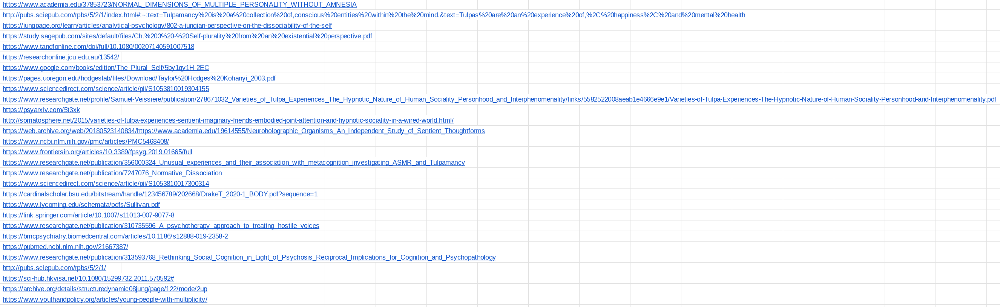

<!--

I asked a friend a while ago to send me all their non clinical research they are aware of. This is all of it. 29 Papers. There might be some they have missed, but effectively, this is nothing.

And this is a big problem. There is obviously no funding for research on non-clinical plurality. If plurality research has to be clinical by default, its no wonder the idea of healthy plurality is so foreign to many in the field.

For the purpose of this talk though, it means that even though I'd love to talk about research for our fellow endo- and parogenic systems, there is just not enough to talk about.

As a matter of fact, most of plurality research soley resolves around DID.

 -->

---

### The fault lines

#### Etiology

- Fantasy: Itratiogenic / Socio-cognitive Model
- Trauma: Biologocial / Structural Dissocation Model

<!--

In Plural research, you have to major factions that have been at odds for the last twenty years.

They are split around the question of "How is it made"?

On the Left side, we have the fantasy model, that very broadly proclaims that people get plural because they have consumed too much plural media or their therapist convinced them. While i make it sound ridiculous and there is even after twenty years no substantial evidence supporting these models, it is important to understand that they have a historic background.

On the right side stands the trauma model. It has a couple of different sub models, but they overall propose that plurality is the result of profund childhood trauma. There is a lot more evidence that support these models, but it is important to note that neither of these models can really explain the experience of plurality, be it clinical or non-clinical - either.

-->

---

### The celebrities

- Simone Reinders
- Richard Kluft
- Onno van der Hart
- Philip Bromberg
- Janina Fisher
- Bessel van der Kolk
- Pierre Janet

<!--

I gonna do this once I have a proper graphic for the slide

-->

<!--
Sources: 
-  https://en.wikipedia.org/wiki/Judith_Lewis_Herman
- https://en.wikipedia.org/wiki/Allan_Schore
- https://janinafisher.com/
- https://janinafisher.com/tmodel/
- https://psychcentral.com/lib/dissociation-fragmentation-and-self-understanding
- https://neurolaunch.com/did-brain-vs-normal-brain/
- https://www.simplyneuroscience.org/post/dissociative-identity-disorder-and-its-impact-on-the-brain
-->

---

### The history

- Earliest accounts since the end of the 18th Century¹
- Freud: Trauma is always subconscious
- 1970s: Sybil
- 1980s: Satanic Panic²
- 1990s: False Memory
- 2000s: Fantasy Model vs. Trauma Model
- 2010s: MRI Scans + Neurodiversity

<!--
The history of plural research can be described of an history of overcoming biases, disbelief and abuse. There is much of it in it, so lets get through it.

We have a long history of evidence regarding dissociative disorders, but a lot of past stuff is very wacky, so lets start with

Freud had some quite pecuiliar ideas about trauma, and couldn't really make too much sense of dissociation, he did however insist that trauma is to be stored in the subconcious, and being able to retrieve it disproofs his theories, which had to be done by systems to be taken serious. 

Then, in 1978 Sybil got published, it was popular and is credited to increase the interest and awareness of the topic and consequently the diagnosis of multiple people in one body rose substantially. It is here that the idea "media induced" plurality started. The case itself is ... disputed, but what we can say for sure is that a psychiatric patient was heavily commercialized.

With more cases and the psychiatrist disposal, DID research really started rolling in the 80s. At the same time, the satanic panic was at full force in the US. It lead to medical professionals trying to convince their patients that the abuse they have experienced must have happened in the context of satanic rituals, despite the lack of evidence. It lead to actual criminal cases and false accusations. This period caused lasting damage to the credibility of both plural research and plural systems. Especially the  International Society for the Study of Trauma and Dissociation did some infamous actions back then.

As a swing back, the False Memory Syndrome Foundation formed, initially by falsy accoused people. Its important to note that we have enough evidence that false memories can be planted into people, there is no such thing as an false memory syndrome. In terms of research, it resulted in research of MPD / DID and plurality in general to be completely discredited. A lot of really bad papers trying to debunk DID date back to the 1990s.

In the 2000s the fantasy model slowly formed, and over the next few years, most research was partisan on either pro or against it.

A big breakthrough was the Reinders paper in 2012, which will discuss later on. It (a) showed clear evidence of different brain response towards trigger in DID patients, as well as disproving that fantasy prone people could somehow emulate these brain responses.

Another important change was the spread of neurodiversity as a concept, and in many papers published after 2014, DID patients are suddenly treated as people, not research objects.

-->

<!--
Sources:
1: Richard J. Loewenstein (2018) Dissociation debates: everything you know
is wrong, Dialogues in Clinical Neuroscience, 20:3, 229-242, DOI: 10.31887/DCNS.2018.20.3/rloewenstein
2: Spanos, Nicholas P (1996) Multiple identities & false memories : a sociocognitive perspective
-->
---

### Important keywords

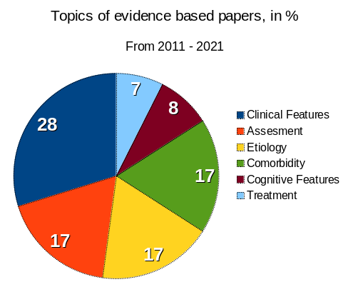

- MRI¹
- Case Study²
- Hypothesis³

<!--

Will do once I have all keywordsi in the list

-->

<!--

Sources:

-->

---

## Step 4:  Examples

<!--

After we got an broad overview of the field of plural science, I want to give you four papers you can start to test your skills.

-->

---

### Fact or Factitious? A Psychobiological Study of Authentic and Simulated Dissociative Identity States

A. A. T. Simone Reinders, Antoon T. M Willemsen, Herry P. J. Vos, Johan A. den Boer, Ellert R. S. Nijenhuis, 2012
 
> *Chose quote*

<!--

This paper does X

-->

---

### What to learn?

- How to do control groups?
- Introduction to different models of plurality
- Brainscience!

---

### Dissociative Identity Disorder

#### Review of Research From 2011 to 2021

Guy A. Boysen, 2024
 
> *Choose quote*

<!--

This paper does X

-->
---

### What to learn?

- Getting an overview of the plural research of the 2010s
- Noticing the focus of said research, as well as the under-researched topic
- Check the statistics

---

### The Persistence of Folly: A Critical Examination of Dissociative Identity Disorder. Part I. The Excesses of an Improbable Concept

August Piper, Harold Mersky, 2004
 
> In the end, positing scores, hundreds, and even thousands of alters defies common sense and reminds one of Tertullian’s claim, Credo quia absurdum est (“I believe that which is impossible,” 141).

  

*[Argument from incredulity](https://en.wikipedia.org/wiki/Argument_from_incredulity)*

<!--

This paper does X

-->

---

### What to learn?

- The anatomy of a bad paper?
- Debunking badly made arguments?
- Noticing the lack of quality markers

---

### It’s just a body: A community-based participatory exploration of the experiences and health care needs for transgender plural people

Susan C. Turell, Christopher Wolf-Gould, Sana Flynn, Silver Mckie, Matthew A. Adan, The Redwoods, 2023
 
> Academics have advocated for community-based participatory research as an important innovation to research with those in the transgender and gender non-conforming (TGNC) community (dickey, Hendricks & Bockting, 2016)Fine and Torre (2019) concluded that critical participatory action research with LGBTQIA+  youth “unveils the hidden” (p. 443) in ways that traditional research cannot.

<!--

This paper does X

-->

---

### What to learn?

- How to do inclusive research
- The link between queerness and plurality
- Proper qualitative research

---

## Conclusion

<!-- 
I have been quite critical with plural science in the last 30 minutes. The truth is, that academa is flawed, because its done by humans, who are flawed themselfs. Yet, the scientific method is awesome, and the vast majority of research do their work with good intentions. Its not paid well enough for bad intentions.

What I hope to have achieved now is to give you& all the first tools to start interacting with science, to dig deeper and to learn more. And ultimately, to make your voices heard in academia aswell. I think the plural perspective is incredible valuable for research. Thank you for listening.
-->

---
