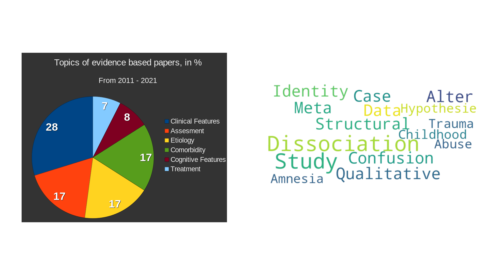
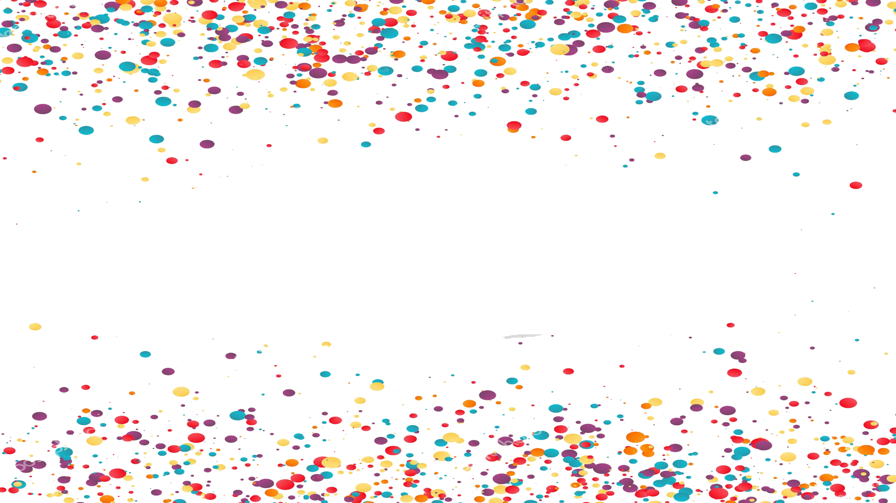

# Can you prove it?

### An introduction to plural science for interested systems

<!-- Insert zeta in  a labcoat -->

---

### Content Warning

<ul>
    <li><b>Bad science</b>
    <ul>
      <li>Medicalism</li>
      <li>Fale Claiming</li>
      <li>Abuse</li>
    </ul>
</ul>

---

### About us

<ul>
<li>Traumagenic system of many</li>
<li>No professional scientist</li>
<li><b>Self-Plug</b></li>
  <ul>
  <li>Podcast</li>
  <li>Little research project</li>
  <li><Github href="github.com/plural-activism/presentation_introduction-to-plural-science">Github</a></li>
</ul>

##### github.com/plural-activism/presentation_introduction-to-plural-science

#### papers.plural.ziegel.me

<!--
- Podcast
- Jemars Research Project
- Github
-->

---

## Step 0: Preparations

---

# 50% of the time, statistics is important all of the time

---

### Theory of Science

- **Find**
- **Read**
- **Contextualize**

<!-- 
- How to find good sources?
- How to read sources?
- How to contextualize sources? 
-->

---

### Psychology

> Overrated af, ngl

*zeta, 2025*

---

## Selfcare

<!--  
- Science is dehumanizing
- Science can be overwhelming
-->
---

## Step 2: Reading research

---

### Where to find papers?

---

---

### The anatomy of a paper

- Keywords
<!-- Only a handful allowed -> good  overview of why the paper is important -->
- Abstract
<!-- Like the back text of textbook, tries to sell the paper, highlights what the research question is, why it is important, how they did research and summarizes the results -->
- Methodology
<!-- Important to understand the qualities of a paper -->
- Results
<!-- What did they find? -->

---

<!-- Keywords -->

<!-- 
- Limited Amount
- Used to find the paper
- -> Great to understand what the paper is about
-->

---

<!-- 
Usually, an abstract contains 4 parts, as you can see here:

The light pink part contextualize the ideas the paper uses, it drops the important keywords for people in the field to know what they base their work on.

In the greent part, the sell us why their work is important.

The yellow sentence shows what they do in the paper, what their methodology is.

Then the highlight the most important result, in the case of this paper, the last sentence is a mix of results and methods.
-->

---

<!-- Methodology -->

<!-- 

Reading Methodology can be tough

-->

---

<!-- Results -->

<!-- 

While a lot of people recommend to read the conclusion rather than the results, I think its better for beginners to focus on the latter. The difference is that the results are the raw, uninterpreted data, while the conclusion is the ... well conclusions that can be extracted out of it.

When reading the results, think for yourself
- What would I conclude of this?
- Are there results I didn't expected and why?
- Are there results I'd expect, but that are missing?
- What seems to be the most important result in there, what is the least important?
- How does these results connect with things I already know?

If you keep notes with these questions in mind, you will pretty quickly build 

-->

---

#### Quality Markers: Is it easy to read?

<!-- 

At first this sounds counterintuitive. Science is supposed to be rigorous, solving hard to grasp problems. The thing is though, scientific writing is a skill that can be practiced. The difference between a beginner scientist and a veteran is often how easy they can convey their ideas. And thats the second point why easy to read papers are important. A paper is the culmination of all the ideas, data and conclusions a scientist have, presented in a way so its accessible to the world. If the world cannot understand it, someone failed their assignment.

So when reading a paper, check if 
- it uses overly complicated sentence structures or unusual grammar and vocabulary?
- Does it explain all concepts it introduces and justify why they are important? You might have too look them up still, but if you don't even know where to start, its a badly written paper?
- Notice the small things - are all abbreviations spelled out at least once? Are there spelling mistakes? Bad formatting? 

A paper might contain super complex ideas, but it should make it as easy as possible to understand them. If it doesn't that usually means someone inexperienced wrote it, or someone who didn't want to put in the effort.
-->

---

#### Quality Markers: Is it Peer Review?

- **Always** insist on peer review
- Not perfect, but insures quality baselevel
- Only Exception: **Arxiv**

---

#### Quality Markers: What is the Methodology?

- Type of data
- Type of analysis
<!--
- Sample size
- Sample selection
- Sample diversity
- Sample representativity
-->

---

#### Quality Markers: H-index

> The h-index is an author-level metric that attempts to measure both the productivity and citation impact of the publications of a scientist or scholar.¹

<!-- 

Both H-Index of citation does not indicate the quality of a paper by itself - but it can tell us if the author and their paper has made an impact. Even if its impact because they did some reaaally bad job and now everyone loves cite them as an example of bad work.

As you might have noticed, the H-index is a metric of the author, so what can you do if there is more than one author? You could of course check all authors, but honestly checking the first one is enough. That is usually the one who contributed the most to the paper (good practice) or the one with the most reputation (bad practice).

This is the H-Index of A A T S Reinders and finding hers is a pain since she seems to love using a different of her four names - or sometimes none - in every paper she has worked on.

-->

<!--
1: Source: 
-->
---

#### Quality Markers: Proper sourcing

- Every claim is sourced
- Every referency is cited at least once
- The sources are relevant to the topic
- The sources actually say what the author claims

<!--

You might have noticed the small numbers at the end of sentences. These are citations, and you can check them out in the slides files.

A scientific work lives or dies with its sources. As a rule of thump, every claim that is not common knowledge (e.g. the sky is blue) needs to have a source. With its sources, an author can highlight their knowledge in the field, and they can show how their work compares to that of others.

At the same time 

-->
---

## Congratulations

<!--

And with that, you have already done 80% of the work of a researcher reading papers! Sure there are more things to consider, and you can always improve your skills, but if you have followed through so far, you are on a really good track already.

-->

---

#### Things to ignore

- The journal
- The author

---

## Step 3: The field of plural science

---

### Non-clinical plurality in science

<!--

I asked a friend a while ago to send me all their non clinical research they are aware of. This is all of it. 29 Papers. There might be some they have missed, but effectively, this is nothing.

And this is a big problem. There is obviously no funding for research on non-clinical plurality. If plurality research has to be clinical by default, its no wonder the idea of healthy plurality is so foreign to many in the field.

For the purpose of this talk though, it means that even though I'd love to talk about research for our fellow endo- and parogenic systems, there is just not enough to talk about.

As a matter of fact, most of plurality research soley resolves around DID.

 -->

---

### The fault lines

#### Etiology

- Fantasy: Itratiogenic / Socio-cognitive Model
- Trauma: Biologocial / Structural Dissocation Model

---

### The celebrities

- Simone Reinders
- Richard Kluft
- Onno van der Hart
- Philip Bromberg
- Janina Fisher
- Bessel van der Kolk
- Pierre Janet

<!--
-  https://en.wikipedia.org/wiki/Judith_Lewis_Herman
- https://en.wikipedia.org/wiki/Allan_Schore
- https://janinafisher.com/
- https://janinafisher.com/tmodel/
- https://psychcentral.com/lib/dissociation-fragmentation-and-self-understanding
- https://neurolaunch.com/did-brain-vs-normal-brain/
- https://www.simplyneuroscience.org/post/dissociative-identity-disorder-and-its-impact-on-the-brain
-->

---

### The history

- Earliest accounts since the end of the 18th Century¹
- Freud: Trauma is always subconscious
- 1970s: Sybil
- 1980s: Satanic Panic²
- 1990s: False Memory
- 2000s: Fantasy Model vs. Trauma Model
- 2010s: MRI Scans + Neurodiversity

<!--
The history of plural research can be described of an history to overcome biases.

We have a long history of evidence regarding dissociative disorders, but a lot of past stuff is very wacky, so lets start with

Freud had some quite pecuiliar ideas about trauma, and couldn't really make too much sense of dissociation, he did however insist that trauma is to be stored in the subconcious, and being able to retrieve it disproofs his theories, which had to be done by systems to be taken serious.

Then, in 1978 Sybil got published, it was popular and is credited to increase the 

-->

<!--
Sources:
1: Richard J. Loewenstein (2018) Dissociation debates: everything you know
is wrong, Dialogues in Clinical Neuroscience, 20:3, 229-242, DOI: 10.31887/DCNS.2018.20.3/rloewenstein
2: Spanos, Nicholas P (1996) Multiple identities & false memories : a sociocognitive perspective
-->
---

### Important keywords

- MRI¹
- Case Study²
- Hypothesis³

---

## Step 4:  Examples

---

### Fact or Factitious? A Psychobiological Study of Authentic and Simulated Dissociative Identity States

A. A. T. Simone Reinders, Antoon T. M Willemsen, Herry P. J. Vos, Johan A. den Boer, Ellert R. S. Nijenhuis, 2012
 
> *Chose quote*

---

### Dissociative Identity Disorder

#### Review of Research From 2011 to 2021

Guy A. Boysen, 2024
 
> *Choose quote*
---

### The Persistence of Folly: A Critical Examination of Dissociative Identity Disorder. Part I. The Excesses of an Improbable Concept

August Piper, Harold Mersky, 2004
 
> In the end, positing scores, hundreds, and even thousands of alters defies common sense and reminds one of Tertullian’s claim, Credo quia absurdum est (“I believe that which is impossible,” 141).

  

*[Argument from incredulity](https://en.wikipedia.org/wiki/Argument_from_incredulity)*

---

### It’s just a body: A community-based participatory exploration of the experiences and health care needs for transgender plural people

Susan C. Turell, Christopher Wolf-Gould, Sana Flynn, Silver Mckie, Matthew A. Adan, The Redwoods, 2023
 
> Academics have advocated for community-based participatory research as an important innovation to research with those in the transgender and gender non-conforming (TGNC) community (dickey, Hendricks & Bockting, 2016)Fine and Torre (2019) concluded that critical participatory action research with LGBTQIA+  youth “unveils the hidden” (p. 443) in ways that traditional research cannot.

---

## Conclusion

<!-- 
I have been quite critical with plural science in the last 30 minutes. The truth is, that academa is flawed, because its done by humans, who are flawed themselfs. Yet, the scientific method is awesome, and the vast majority of research do their work with good intentions. Its not paid well enough for bad intentions.

What I hope to have achieved now is to give you& all the first tools to start interacting with science, to dig deeper and to learn more. And ultimately, to make your voices heard in academia aswell. I think the plural perspective is incredible valuable for research. Thank you for listening.
-->

---
